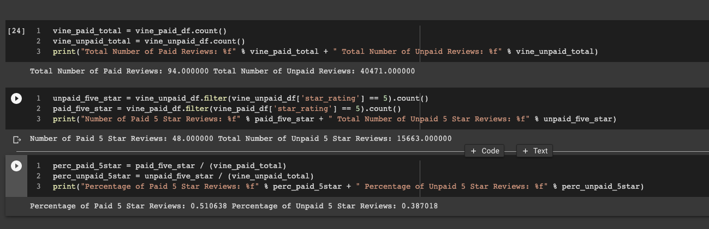

# Amazon Vine Analysis
## Overview of the Analysis

### Purpose
The purpose of this analysis is to analyze Amazon reviews written by members of the paid Amazon Vine program, specifically for video games. The Amazon Vine program is a service that allows manufacturers and publishers to receive reviews for their products. Companies like SellBy pay a small fee to Amazon and provide products to Amazon Vine members, who are then required to publish a review. There are 50 datasets that are available. Each one contains reviews of a specific product, from clothing apparel to wireless products. For this analysis I chose one of the datasets and used PySpark to perform the ETL process to extract the dataset, transform the data, connect to an AWS RDS instance, and load the transformed data into pgAdmin. By using PySpark to determine if there is any bias toward favorable reviews from Vine members in the dataset. Using the findings report to the SellBy stakeholders.

### Results

How many Vine reviews and non-Vine reviews were there?
- Vine reviews (paid): 94
- Non-Vine reviews (unpaid): 40,471

How many Vine reviews were 5 stars? How many non-Vine reviews were 5 stars?
- Vine reviews that were 5 stars (paid): 48
- Non-Vine reviews that were 5 stars (unpaid): 15,663

What percentage of Vine reviews were 5 stars? What percentage of non-Vine reviews were 5 stars?
- The percentage of Vine reviews that were 5 stars (paid): 51.06%
- The percentage of Non-Vine reviews that were 5 stars (unpaid): 38.70%

#### Vine Analysis from PySpark

### Summary

Based on the vine analysis that was performed, we can state that there is no positivity bias for reviews in the Vine program. There were 94 paid reviews and 15663 unpaid reviews. From those paid reviews that were 5 stars were 48 and unpaid reviews that were 5 stars were 15,663.  The percentage of paid reviews that were 5 stars was 51.06% and percentage of unpaid that were 5 stars was 38.70%. The data supports that there were no positivity bias as unpaid had more in the total of reviews and the percentage of unpaid for 5 stars was not skewed to 100%. An additional analysis that could be done on this dataset to support my statement is comparing the verified purchase to the total votes.
